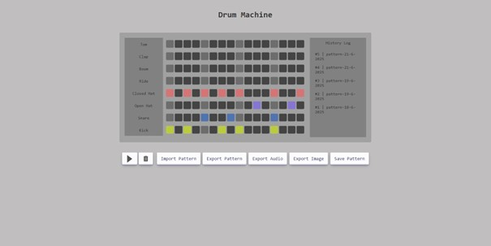

# 🥁 Web Drum Machine

A full-stack, browser-based drum machine that allows users to create, play, and export custom percussion patterns. 

## 📸 Preview
 

## ✨ Features
* **Interactive Sequencer:** 16-step sequencer supporting multiple percussion instruments (Kick, Snare, Hi-Hats, Toms, etc.).
* **Click-and-Drag Painting:** Seamlessly toggle active beats by clicking and dragging across the grid.
* **Audio Exporting:** Renders and exports the user's custom beat directly to a `.wav` audio file using the Web Audio API.
* **State Management:** Import and export beat patterns via `.json` files to save and share progress.
* **History Log (Database):** Automatically saves iterations of the user's pattern to a MySQL database via a PHP backend, allowing users to load previous states from a visual history log.

## 🛠️ Tech Stack
* **Frontend:** HTML5, CSS3, Vanilla JavaScript
* **Audio Processing:** Web Audio API (`OfflineAudioContext` for rendering sound without playback).
* **Backend / Database:** PHP, MySQL (XAMPP environment)

## 🚀 Getting Started

### Prerequisites
Because this project utilizes a PHP backend for the history log and requires the `fetch()` API for local audio rendering (which is restricted by standard browser CORS policies), **you must run this project on a local server** (such as XAMPP, WAMP, or VS Code Live Server with PHP support).

### Installation
1. Clone the repository into your local server directory (e.g., `htdocs` for XAMPP):
   ```bash
   git clone https://github.com/EvaCheer/Drum-Machine.git
   ```
2. Start your local server (Apache and MySQL).
3. Set up the database:
   * Open phpMyAdmin.
   * Create a database and import the required SQL schema.
   * Ensure your `loadHistory.php`, `loadPattern.php`, and `saveInHistory.php` files have the correct database credentials.
4. Navigate to the project URL in your browser (e.g., `http://localhost/Drum-Machine`).
